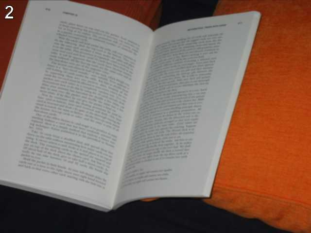

===================================
Python Challenge
===================================

Level 0 [#]_
=============
.. image:: images/calc.jpg
   :scale: 50 %

Hint: try to change the URL address.

第零关主要让人熟悉游戏规则和形式。首先观察标签栏主题显示的是warming up，表明这关的主题是热身。页面图片下标注一行小提示尝试改变url的地址。在没有别的提示下，明显是改成图片内的内容， 2^38。打开Python解释器，输入"2**38"，显示答案"274877906944L"。去掉L替换URL中的0得到下一关地址。

http://www.pythonchallenge.com/pc/def/map.html

这一关想表明的是Python中的整数的储存。Python中的整数相当于C中的长整型(long), 32位的机器上整型取值范围为 -2147483648至2147483647, 64位机器上为-9223372036854775808到9223372036854775807。Python的长整型是无限制的，只要内存允许。很相似的是Python里的无限list。一个很著名的例子是使用生成器(generator)，就可以生成一个无限长的Fibonacci数列：

.. code-block:: python
   
    def fib():
        a = b = 1
        while True:
            yield a
            a,b = b,a+b

Level 1
========
.. image:: images/map.jpg
   :scale: 50 %
   
Hint1: K -> M,  O -> Q,  E -> G

Hint2: g fmnc wms bgblr rpylqjyrc gr zw fylb. rfyrq ufyr amknsrcpq ypc dmp. bmgle gr gl zw fylb gq glcddgagclr ylb rfyr'q ufw rfgq rcvr gq qm jmle. sqgle qrpgle.kyicrpylq() gq pcamkkclbcb. lmu ynnjw ml rfc spj.

同样的首先观察标签栏主题, "what about making trans"。这个提示很有启发性。然后观察图片, K->M, O->Q, E->G, 每个字母对应其后的两个字母, 很显然的一个 `凯撒密码 <http://zh.wikipedia.org/zh/凯撒密码>`_ 。最后观察图下的提示, "everybody think twice before solving this"和一堆乱码。按照图片中的方法, 把乱码还原。可以通过ASCII码与字符的转换来做（ord, chr）；或者直接使用string模块（table = string.maketrancs(from,to),  string.translate(raw_str, table)）。将转换关系运用到Hint2的字符串即可。

.. code-block:: python
   
    In [22]: import string

    In [23]: table = string.maketrans( string.ascii_lowercase, string.ascii_lowercase[2:]+string.ascii_lowercase[:2])

    In [24]: code = "g fmnc wms bgblr rpylqjyrc gr zw fylb. rfyrq ufyr amknsrcpq ypc dmp. bmgle gr gl zw fylb gq glcddgagclr ylb rfyr'q ufw rfgq rcvr gq qm jmle. sqgle qrpgle.kyicrpylq() gq pcamkkclbcb. lmu ynnjw ml rfc spj"

    In [25]: code.translate(table)
    Out[25]: "i hope you didnt translate it by hand. thats what computers are for. doing it in by hand is inefficient and that's why this text is so long. using string.maketrans() is recommended. now apply on the url"

    In [26]: "map".translate(table)
    Out[26]: 'ocr'

得到下一关地址 http://www.pythonchallenge.com/pc/def/ocr.html

Level 2
========

Hint1: recognize the characters. maybe they are in the book, 
but MAYBE they are in the page source.

这里提示查看网页的源代码，然后得到提示2

Hint2: 网页源码的注释中有: find rare characters in the mess below；下面是一堆字符。显然是从这对字符中找出现次数最少的；注意忽略空白符，出现次数同样多的字符按出现次序排序。拷贝乱码字符到文件level2code.txt，处理代码如下：

.. code-block:: python

    char_count = {}
    for line in open("level2code.txt"):
        for c in line:
            char_count.setdefault(c, 0)
            char_count[c] += 1

    sorted_chars = sorted(char_count.items(), key=lambda x: x[1])
    print sorted_chars

得到结果::

    [('a', 1), ('e', 1), ('i', 1), ('l', 1), ('q', 1), ('u', 1), ('t', 1), ('y', 1), ('\n', 1220), ('^', 6030), ('*', 6034), ('&', 6043), ('$', 6046), ('{', 6046), ('+', 6066), ('!', 6079), ('%', 6104), ('}', 6105), ('[', 6108), ('_', 6112), ('#', 6115), (']', 6152), ('(', 6154), ('@', 6157), (')', 6186)]

可以看出最少的字母是 'a', 'e', 'i', 'l', 'q', 'u', 't', 'y'， 按照出现次数同样多的字符按出现次序排序

.. code-block:: python

    chars = ['a', 'e', 'i', 'l', 'q', 'u', 't', 'y']
    all_str = "".join(open("level2code.txt"))
    chars_ind = [(c, all_str.find(c)) for c in chars]
    print ''.join([c[0] for c in sorted(chars_ind, key=lambda x: x[1])])

结果是 **equality** 下一关地址是 http://www.pythonchallenge.com/pc/def/equality.html

Level 3
========
.. image:: images/bodyguard.jpg
   :scale: 50 %

Hint1：One small letter, surrounded by EXACTLY three big bodyguards on each of its sides.

Hint2： 网页源码中又是一堆字符。

用正则表达式， 找到这样的“小写字符”：其两侧恰好都被3个大写字母占据。

.. code-block:: python

    import re
    all_str = "".join(open("level3code.txt"))
    chars = re.findall(r'[^A-Z][A-Z]{3}([a-z])[A-Z]{3}[^A-Z]', all_str)
    print "".join(chars)

结果是 **linkedlist** 下一关地址是 http://www.pythonchallenge.com/pc/def/linkedlist.php

Level 4
========
.. image:: images/chainsaw.jpg
   :scale: 50 %

Hint1： <!-- urllib may help. DON'T TRY ALL NOTHINGS, since it will never end. 400 times is more than enough. -->

Hint2：<a href="linkedlist.php?nothing=12345">

打开http://www.pythonchallenge.com/pc/def/linkedlist.php?nothing=12345，结果是 **and the next nothing is 44827**

用urllib 和 re 模块继续处理下去，直到出现 Yes. Divide by two and keep going. 此时所在页面是：http://www.pythonchallenge.com/pc/def/linkedlist.php?nothing=16044

16044/2=8022，从http://www.pythonchallenge.com/pc/def/linkedlist.php?nothing=8022 继续处理。

最后出现 **peak.html** 下一关地址是 http://www.pythonchallenge.com/pc/def/peak.html

.. code-block:: python

    import re
    import urllib

    next = "8022"
    url = ""
    response = ""
    while next:
        url = "http://www.pythonchallenge.com/pc/def/linkedlist.php?nothing="+next
        res = urllib.urlopen(url)
        response = res.read()

        # handle the solution (last) line
        if re.findall(r'\.html$', response):
            break
        
        code = re.findall(r'\d+$', response)

        if(code):
            next = code[0]
        else:
            # handle the divide by two line
            next = str (int (next) / 2 )

        print url
        print response

Level 5
========
.. image:: images/peakhell.jpg
   :scale: 50 %

Hint1： pronounce it

Hint2:  图片中是一座小山 (hill)

Hint3： 网页源码中：<!-- peak hell sounds familiar ? -->

Hint4： 网页源码中：<peakhell src="banner.p"/>， banner.p 可以下载。

"peak hell" 发音类似 "pickle"，用pickle 处理banner.p。

.. code-block:: python

    >>> import pickle
    >>> banner = pickle.load(open("banner.p", 'r'))
    >>> banner
    [[(' ', 95)], [(' ', 14), ... (omitted)
    >>> len(banner)
    23

可以看到是一个嵌套list，总共23个，每个list里是一些字符-数字对，猜测数字是字符重复的次数，试着打印这些字符::

    for linelist in banner:
        print "".join(ch * count for ch, count in linelist)

出现 **channel** 下一关地址是 http://www.pythonchallenge.com/pc/def/channel.html

.. [#] `Python Challenge的解答 <http://www.syoon.me/python/index.html>`_
