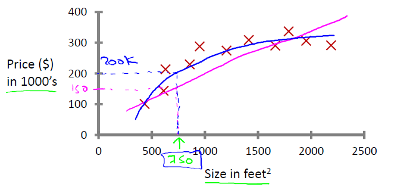
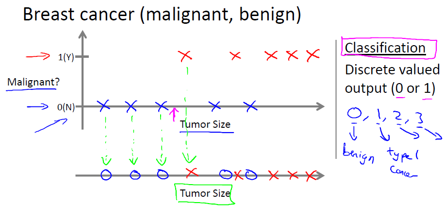
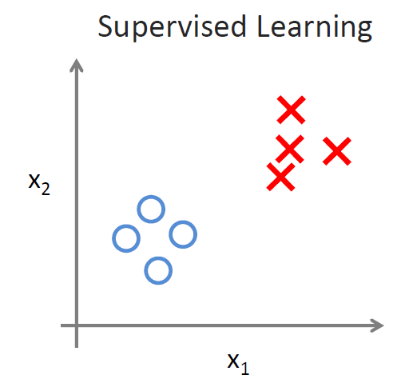
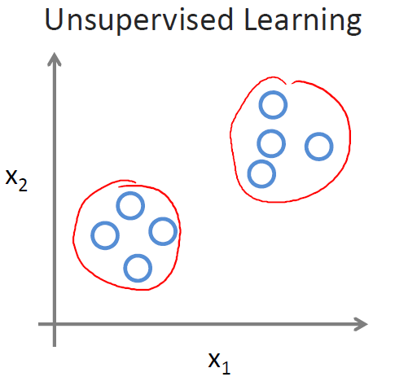
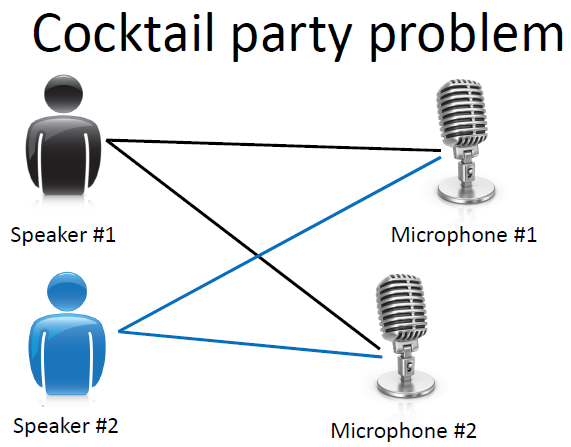

============
Introduction
============
以下是第一课“引言”的PPT课件资料，视频可以在Coursera机器学习课程上观看或下载：
`ppt <https://d19vezwu8eufl6.cloudfront.net/ml/docs%2Fslides%2FLecture1.pptx>`_
`pdf <https://d19vezwu8eufl6.cloudfront.net/ml/docs%2Fslides%2FLecture1.pdf>`_

机器学习定义
============

机器学习是人工智能的一个分支，目标是赋予机器一种新的能力。机器学习的应用很广泛，
例如大规模的数据挖掘（网页点击数据，医疗记录等），无人驾驶飞机、汽车，手写手别，
大多数的自然语言处理任务，计算机视觉，推荐系统等。机器学习有很多定义，
广为人知的有如下两条：

*   Arthur Samuel (1959) [#]_: Machine Learning: Field of study that gives 
    computers the ability to learn without being explicitly programmed.

*   Tom Mitchell (1998) : Well-posed Learning Problem: A computer program 
    is said to learn from experience E with respect to some task T 
    and some performance measure P, if its performance on T, as measured by P, 
    improves with experience E.

 

**例子** ：对于一个垃圾邮件识别的问题，将邮件分类为垃圾邮件或非垃圾邮件是任务T，
查看哪些邮件被标记为垃圾邮件哪些被标记为非垃圾邮件是经验E，正确识别的垃圾邮件或
非垃圾邮件的数量或比率是评测指标P。

机器学习算法的类型
==================

#.  有监督学习(Supervised learning):通过生成一个函数将输入映射为一个合适的输出
    （通常也称为标记，多数情况下训练集都是有人工专家标注生成的）。例如分类问题，
    分类器更加输入向量和输出的分类标记模拟了一个函数，对于新的输入向量，得到它的分类结果。

#.  无监督学习(Unsupervised learning):与有监督学习相比，训练集没有人为标注的结果。
    常见的无监督学习算法有聚类。

#.  半监督学习: 介于监督学习与无监督学习之间。

#.  强化学习(Reinforcement learning): 通过观察来学习如何做出动作，每个动作都会对环境
    有所影响，而环境的反馈又可以引导该学习算法。

其他的类型包括推荐系统，Transduction，Learning to learn等。

有监督学习详解
==============

有监督学习主要会提供一些标注样本，分为两大问题：回归和分类

房屋价格预测-回归(Regression): 预测连续的输出值（价格)

乳腺癌（良性，恶性）预测问题-分类(Classification): 预测离散的输出值(0, 1)

无监督学习详解
==============

给定一组数据，这些数据从外表上来看没有什么差别，都落在了坐标轴上，
我们的目标是从中找出结构，并将其分组，如下图，是有监督学习和无监督学习的对比，
无监督学习给出的是聚类的例子，每个数据都是以原点的形式出现的，
但是我们能够很清晰地将这些点分成两组(group into)：

例子: Google News， 基因序列分析，社会网络分析，市场切分等...

特别的例子： **鸡尾酒会问题（Cocktail party problem）**

“ 鸡尾酒会问题”（cocktail party problem）是在计算机语音识别领域的一个问题，
当前语音识别技术已经可以以较高精度识别一个人所讲的话，但是当说话的人数为两人或者多人时，
语音识别率就会极大的降低，这一难题被称为鸡尾酒会问题。

鸡尾酒会问题算法（一行代码）::

    [W,s,v] = svd((repmat(sum(x.*x,1),size(x,1),1).*x)*x');

一些参考资料：

#. 解决方法ICA demo: http://research.ics.tkk.fi/ica/cocktail/cocktail_en.cgi
#. http://www.vislab.uq.edu.au/education/sc3/2001/johan/johan.pdf
#. http://www.physorg.com/news75477497.html
#. http://en.wikipedia.org/wiki/Cocktail_party_effect
#. http://www.scientificamerican.com/article.cfm?id=solving-the-cocktail-party-problem

以下关于"cocktail party problem"的文字引用自该链接： http://xiaozu.renren.com/xiaozu/121443/thread/335879281 ::

    stanford机器学习公开课(ml-class.org)第一章unsupervised learning那段视频里解决鸡尾酒会问题(cocktail party problem)就写了一行代码：

    [W,s,v] = svd ((repmat(sum(x.*x,1),size(x,1),1).*x)*x');

    lz土人感觉是用了PCA的方法。。可是W运行出来丝毫没有unmixing的效果。。。用的是采样频率16kHz的Speech-Speech和Speech-Music两个样例。。
    google这条代码有post说这是ICA，我就迷茫了。。。看不出来怎么是ICA了。。折腾一夜了，毫无头绪。。。
    顺便求此问题的demo。。各种语言均无妨。。

.. rubric:: Footnotes
.. [#] Arthur Lee Samuel (1901–1990) 教授是美国人工智能领域的先驱，他设计了一些下棋程序，可以通过不断的下棋来学习，从而达到很高的下棋水平。

