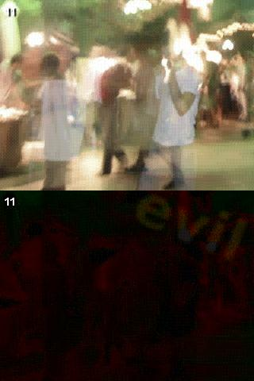
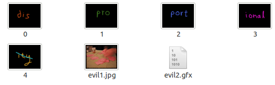

===================================
Python Challenge
===================================

Level 0 [#]_
=============
.. image:: images/calc.jpg
   :scale: 50 %

Hint: try to change the URL address.

第零关主要让人熟悉游戏规则和形式。首先观察标签栏主题显示的是warming up，表明这关的主题是热身。页面图片下标注一行小提示尝试改变url的地址。在没有别的提示下，明显是改成图片内的内容， 2^38。打开Python解释器，输入"2**38"，显示答案"274877906944L"。去掉L替换URL中的0得到下一关地址。

http://www.pythonchallenge.com/pc/def/map.html

这一关想表明的是Python中的整数的储存。Python中的整数相当于C中的长整型(long), 32位的机器上整型取值范围为 -2147483648至2147483647, 64位机器上为-9223372036854775808到9223372036854775807。Python的长整型是无限制的，只要内存允许。很相似的是Python里的无限list。一个很著名的例子是使用生成器(generator)，就可以生成一个无限长的Fibonacci数列：

.. code-block:: python
   
    def fib():
        a = b = 1
        while True:
            yield a
            a,b = b,a+b

Level 1
========

   
Hint1: K -> M,  O -> Q,  E -> G

Hint2: g fmnc wms bgblr rpylqjyrc gr zw fylb. rfyrq ufyr amknsrcpq ypc dmp. bmgle gr gl zw fylb gq glcddgagclr ylb rfyr'q ufw rfgq rcvr gq qm jmle. sqgle qrpgle.kyicrpylq() gq pcamkkclbcb. lmu ynnjw ml rfc spj.

同样的首先观察标签栏主题, "what about making trans"。这个提示很有启发性。然后观察图片, K->M, O->Q, E->G, 每个字母对应其后的两个字母, 很显然的一个 `凯撒密码 <http://zh.wikipedia.org/zh/凯撒密码>`_ 。最后观察图下的提示, "everybody think twice before solving this"和一堆乱码。按照图片中的方法, 把乱码还原。可以通过ASCII码与字符的转换来做（ord, chr）；或者直接使用string模块（table = string.maketrancs(from,to),  string.translate(raw_str, table)）。将转换关系运用到Hint2的字符串即可。

.. code-block:: python
   
    In [22]: import string

    In [23]: table = string.maketrans( string.ascii_lowercase, string.ascii_lowercase[2:]+string.ascii_lowercase[:2])

    In [24]: code = "g fmnc wms bgblr rpylqjyrc gr zw fylb. rfyrq ufyr amknsrcpq ypc dmp. bmgle gr gl zw fylb gq glcddgagclr ylb rfyr'q ufw rfgq rcvr gq qm jmle. sqgle qrpgle.kyicrpylq() gq pcamkkclbcb. lmu ynnjw ml rfc spj"

    In [25]: code.translate(table)
    Out[25]: "i hope you didnt translate it by hand. thats what computers are for. doing it in by hand is inefficient and that's why this text is so long. using string.maketrans() is recommended. now apply on the url"

    In [26]: "map".translate(table)
    Out[26]: 'ocr'

得到下一关地址 http://www.pythonchallenge.com/pc/def/ocr.html

Level 2
========
.. image:: images/ocr.jpg
   :scale: 50 %

Hint1: recognize the characters. maybe they are in the book, 
but MAYBE they are in the page source.

这里提示查看网页的源代码，然后得到提示2

Hint2: 网页源码的注释中有: find rare characters in the mess below；下面是一堆字符。显然是从这对字符中找出现次数最少的；注意忽略空白符，出现次数同样多的字符按出现次序排序。拷贝乱码字符到文件level2code.txt，处理代码如下：

.. code-block:: python

    char_count = {}
    for line in open("level2code.txt"):
        for c in line:
            char_count.setdefault(c, 0)
            char_count[c] += 1

    sorted_chars = sorted(char_count.items(), key=lambda x: x[1])
    print sorted_chars

得到结果::

    [('a', 1), ('e', 1), ('i', 1), ('l', 1), ('q', 1), ('u', 1), ('t', 1), ('y', 1), ('\n', 1220), ('^', 6030), ('*', 6034), ('&', 6043), ('$', 6046), ('{', 6046), ('+', 6066), ('!', 6079), ('%', 6104), ('}', 6105), ('[', 6108), ('_', 6112), ('#', 6115), (']', 6152), ('(', 6154), ('@', 6157), (')', 6186)]

可以看出最少的字母是 'a', 'e', 'i', 'l', 'q', 'u', 't', 'y'， 按照出现次数同样多的字符按出现次序排序

.. code-block:: python

    chars = ['a', 'e', 'i', 'l', 'q', 'u', 't', 'y']
    all_str = "".join(open("level2code.txt"))
    chars_ind = [(c, all_str.find(c)) for c in chars]
    print ''.join([c[0] for c in sorted(chars_ind, key=lambda x: x[1])])

结果是 **equality** 下一关地址是 http://www.pythonchallenge.com/pc/def/equality.html

Level 3
========
.. image:: images/bodyguard.jpg
   :scale: 50 %

Hint1：One small letter, surrounded by EXACTLY three big bodyguards on each of its sides.

Hint2： 网页源码中又是一堆字符。

用正则表达式， 找到这样的“小写字符”：其两侧恰好都被3个大写字母占据。

.. code-block:: python

    import re
    all_str = "".join(open("level3code.txt"))
    chars = re.findall(r'[^A-Z][A-Z]{3}([a-z])[A-Z]{3}[^A-Z]', all_str)
    print "".join(chars)

结果是 **linkedlist** 下一关地址是 http://www.pythonchallenge.com/pc/def/linkedlist.php

Level 4
========
.. image:: images/chainsaw.jpg
   :scale: 50 %

Hint1： <!-- urllib may help. DON'T TRY ALL NOTHINGS, since it will never end. 400 times is more than enough. -->

Hint2：<a href="linkedlist.php?nothing=12345">

打开http://www.pythonchallenge.com/pc/def/linkedlist.php?nothing=12345，结果是 **and the next nothing is 44827**

用urllib 和 re 模块继续处理下去，直到出现 Yes. Divide by two and keep going. 此时所在页面是：http://www.pythonchallenge.com/pc/def/linkedlist.php?nothing=16044

16044/2=8022，从http://www.pythonchallenge.com/pc/def/linkedlist.php?nothing=8022 继续处理。

最后出现 **peak.html** 下一关地址是 http://www.pythonchallenge.com/pc/def/peak.html

.. code-block:: python

    import re
    import urllib

    next = "8022"
    url = ""
    response = ""
    while next:
        url = "http://www.pythonchallenge.com/pc/def/linkedlist.php?nothing="+next
        res = urllib.urlopen(url)
        response = res.read()

        # handle the solution (last) line
        if re.findall(r'\.html$', response):
            break
        
        code = re.findall(r'\d+$', response)

        if(code):
            next = code[0]
        else:
            # handle the divide by two line
            next = str (int (next) / 2 )

        print url
        print response

Level 5
========
.. image:: images/peakhell.jpg
   :scale: 50 %

Hint1： pronounce it

Hint2:  图片中是一座小山 (hill)

Hint3： 网页源码中：<!-- peak hell sounds familiar ? -->

Hint4： 网页源码中：<peakhell src="banner.p"/>， banner.p 可以下载。

"peak hell" 发音类似 "pickle"，用pickle 处理banner.p。

.. code-block:: python

    >>> import pickle
    >>> banner = pickle.load(open("banner.p", 'r'))
    >>> banner
    [[(' ', 95)], [(' ', 14), ... (omitted)
    >>> len(banner)
    23

可以看到是一个嵌套list，总共23个，每个list里是一些字符-数字对，猜测数字是字符重复的次数，试着打印这些字符::

    for linelist in banner:
        print "".join(ch * count for ch, count in linelist)

出现 **channel** 下一关地址是 http://www.pythonchallenge.com/pc/def/channel.html

Level 6 [#]_
=============
.. image:: images/peakhell.jpg
   :scale: 50 %

Hint1：<!-- <-- zip --> 根据提示，应该和zip文件有关（Python有zipfile模块）。

将channel.html 改为 channel.zip，发现可以下载。channel.zip解压后，channel文件夹中是一系列txt文件。其中一个文件名是"readme",其余是数字名。打开readme.txt::

    welcome to my zipped list.
    hint1: start from 90052
    hint2: answer is inside the zip

好吧，从90052.txt 开始处理。直到出现：Collect the comments. 哪里有comments？ 没办法，学习zipfile模块吧，果然有comment属性。
上述过程再重复一遍（还是从90052.txt）开始，记录每次遇到的文件的comment(如：``z=zipfile.ZipFile('channel.zip'); z.getinfo('90052.txt').comment`` )

打印记录的comments，形如"hockey"。

.. code-block:: python

    import zipfile, re
    findnothing = re.compile(r"Next nothing is (\d+)").match
    comments = []
    z = zipfile.ZipFile("channel.zip", "r")
    seed = "90052"
    while True:
        fname = seed + ".txt"
        comments.append(z.getinfo(fname).comment)
        guts = z.read(fname)
        m = findnothing(guts)
        if m:
            seed = m.group(1)
        else:
            break
    print "".join(comments)

打开 http://www.pythonchallenge.com/pc/def/hockey.html::

    it's in the air. look at the letters. 

表示还没完，要从letters中找答案。组成"hockey"形状的单词分别是O、X、Y、G、E、N，即"oxygen"::

    ****************************************************************
    ****************************************************************
    **                                                            **
    **   OO    OO    XX      YYYY    GG    GG  EEEEEE NN      NN  **
    **   OO    OO  XXXXXX   YYYYYY   GG   GG   EEEEEE  NN    NN   **
    **   OO    OO XXX  XXX YYY   YY  GG GG     EE       NN  NN    **
    **   OOOOOOOO XX    XX YY        GGG       EEEEE     NNNN     **
    **   OOOOOOOO XX    XX YY        GGG       EEEEE      NN      **
    **   OO    OO XXX  XXX YYY   YY  GG GG     EE         NN      **
    **   OO    OO  XXXXXX   YYYYYY   GG   GG   EEEEEE     NN      **
    **   OO    OO    XX      YYYY    GG    GG  EEEEEE     NN      **
    **                                                            **
    ****************************************************************
     **************************************************************

下一关地址是 http://www.pythonchallenge.com/pc/def/oxygen.html

Level 7
=======
.. image:: images/oxygen.png
   :scale: 50 %

Hint1：图片中有一道灰度条。

没有其他提示，必然要从图片下手了。用到PIL。该图像模式是RGBA。每个像素是个四元组，前3个分量分别代表红(R)、绿(G)、蓝(B)，对于灰度图像，R=B=G。这样，我们可以找到这段灰度条。使用 ``getpixel((width, height))`` 得到像素点的RGB值，将其数值按照ASCII码映射为字符（chr 函数）。

.. code-block:: python

    import Image

    im = Image.open("../images/oxygen.png")
    print "Image info:",im.format, im.size, im.mode

    height = 0
    for h in range(im.size[1]):
        pixel = im.getpixel((0, h))
        if(pixel[0]==pixel[1] and pixel[1]==pixel[2]):
            height = h
            break

    ascii = [-1]
    for w in range(0, im.size[0], 7):
        pixel = im.getpixel((w, height))
        if(pixel[0]==pixel[1] and pixel[1]==pixel[2]):
            ascii.append(pixel[0])
        else:
            break

    ascii.remove(-1)
    print "".join([chr(asc) for asc in ascii])

打印出来的信息是::

    smart guy, you made it. the next level is [105, 110, 116, 101, 103, 114, 105, 116, 121]

表示还没完，继续用chr转换后面的数值得到下一关的地址 **integrity** 即 http://www.pythonchallenge.com/pc/def/integrity.html

Level 8
=======
.. image:: images/integrity.jpg
   :scale: 50 %

Hint1：Where is the missing link?

发现图片是有链接的，点击后弹出登录框，需要用户名和密码，打开网页源代码，看到::

    <!--
    un: 'BZh91AY&SYA\xaf\x82\r\x00\x00\x01\x01\x80\x02\xc0\x02\x00\x00!\x9ah3M\x07<]\xc9\x14\xe1BA\x06\xbe\x084'
    pw: 'BZh91AY&SY\x94$|\x0e\x00\x00\x00\x81\x00\x03$\x00!\x9ah3M\x13<]\xc9\x14\xe1BBP\x91\xf08'
    -->

其中un、pw 都是"BZh"开头，应该是bz2编码，于是用python的bz2库来解码，结果是::

    In [40]: import bz2

    In [41]: bz2.
    bz2.BZ2Compressor    bz2.BZ2Decompressor  bz2.BZ2File          bz2.compress         bz2.decompress

    In [41]: bz2.decompress('BZh91AY&SYA\xaf\x82\r\x00\x00\x01\x01\x80\x02\xc0\x02\x00 \x00!\x9ah3M\x07<]\xc9\x14\xe1BA\x06\xbe\x084')
    Out[41]: 'huge'

    In [42]: bz2.decompress('BZh91AY&SY\x94$|\x0e\x00\x00\x00\x81\x00\x03$ \x00!\x9ah3M\x13<]\xc9\x14\xe1BBP\x91\xf08')
    Out[42]: 'file'

这就是"../return/good.html"页面需要的用户名密码了。下一关地址 http://www.pythonchallenge.com/pc/return/good.html

Level 9
=======
.. image:: images/good.jpg
   :scale: 50 %

打开源代码，看到提示： **first+second=?** 然后是两大块数字，根据图片中的黑点的意思，猜测是要通过描点画出一个轮廓图来，这两块数字矩阵估计是像素值。

.. code-block:: python

    import Image,ImageDraw
    im = Image.new('RGB', (500,500))
    draw = ImageDraw.Draw(im)
    first=[146,399,163,403, ...]  # chunked
    second=[156,141,165,135, ...] # chunked
    draw.polygon(first,fill='white')
    draw.polygon(second,fill='white')
    im.save('09.jpg')

这里用到了 `ImageDraw <http://infohost.nmt.edu/tcc/help/pubs/pil/image-draw.html>`_ 库，其中的 ``draw.polygon(first,fill='white')``
用来画多边形的函数::

    .polygon(L, fill=None, outline=None)
        Works like the .line() method, but after drawing all the specified line segments, it draws one more that connects the last point back to the first. The interior displays the fill, transparent by default. The border is drawn in the outline color, defaulting to white.

        For example, draw.polygon([(60,60), (90,60), (90,90), (60,90)], fill="red", outline="green") would draw a square box with a green outline, filled with red.

画出来的图片是

.. image:: images/09.jpg
   :scale: 50 %

……这是头公牛，试试英文单词bull，OK！下一关地址是 http://www.pythonchallenge.com/pc/return/bull.html

Level 10
========
.. image:: images/bull.jpg
   :scale: 50 %

Hint1: len(a[30]) = ?

打开源代码，看到有个 **"sequence.txt"** 链接，里面是一个数列::

    a = [1, 11, 21, 1211, 111221, 

google后知道这是一个 `Look-and-say sequence <http://en.wikipedia.org/wiki/Look-and-say_sequence>`_ 数列，就是说下一个数是前一个数读出来。
代码生成这个数列，然后打印a[30]的长度。

.. code-block:: python

    def readNum(num_seq):
        next_num = ""
        index = 0
        cur = num_seq[index]
        index += 1
        while index < len(num_seq):
            while index < len(num_seq) and num_seq[index] == cur[0]:
                cur += num_seq[index]
                index += 1
            else:
                if index < len(num_seq):
                    next_num += str(len(cur))+cur[0]
                    cur = num_seq[index]
                    index += 1
        else:
            next_num += str(len(cur))+cur[0]

        return next_num

    a = ['1']
    for i in range(30):
        a.append(readNum(a[i]))

    print len(a[30])

结果是5808，下一关地址是 http://www.pythonchallenge.com/pc/return/5808.html

Level 11
========
.. image:: images/cave.jpg
   :scale: 50 %

打开源代码，没有任何提示，观察图片，明显是两张图片重叠在一起的，根据网页标题odd even,
猜测可以按奇偶把图片分解为两张图片。代码如下:

.. code-block:: python

    import Image
    src = Image.open("cave.jpg")
    w,h = src.size[0], src.size[1]
    print "Image info:",src.format, src.size, src.mode
    new = Image.new(src.mode,(w/2, h))

    for i in range(w*h):
        y, x = divmod(i, w)
        p = src.getpixel((x,y))
        if i%2:
            new.putpixel((x/2,y/2+h/2),p)
        else:
            new.putpixel((x/2,y/2),p)
    new.save('11.jpg')

可以看到 **evil** ，下一关地址是 http://www.pythonchallenge.com/pc/return/evil.html

Level 12 [#]_
==============
.. image:: images/evil1.jpg
   :scale: 50 %

第一眼看到这道题的时候，还以为又是图片处理，但是又没有发现这张图到底有哪里需要处理的，
于是就放弃了这个想法，然后看了看title和页面源代码。源代码是相当的干净简洁，什么注释都没有，
唯一有的提示就只剩下title了——dealing evil。在整个源代码中能够找到于evil有关的就只有img标签的src了。
仔细观察会发现src是 **evil1.jpg** ，既然有1，那么是否会有2、3、4甚至更多的图呢？
于是接下来就是更改url来查看图片。将url改成evil2.jpg会看到提示：不是jpg，是gfx。
那么就将后缀名改为gfx，这样就可以得到一个不知道是干吗的二进制文件。继续更改url看看能不能得到更多的信息，
在evil3.jpg上会看到“no more evils...”。也就是说没有evil可以处理了。

对于这个不知所谓的二进制文件完全不知道怎么下手，思考了很长时间也不得要领，出于无奈只好百度答案了，
后来发现原来在evil3后面还有4，不过4只有在ie中才能看到（我尝试过在chrom、firefox、opera中查看，都看不到）。
但是我觉得没有什么有价值的信息，果然还是到3就可以结束了（可能是因为我对外国文化不是很了解，
有一个外国人的blog说以后会用到这个信息）。到目前为止所有信息到被找到了，可是唯独有一样信息没有被用上，
那就是第一张图，在这张图上是一个人在分牌，牌被分为了5份，这是在暗示我们，
将得到的gfx文件也按照发牌的方式分成五分，于是就可以得到下面的代码:

.. code-block:: python

    #! /usr/bin/env python
    '''python challenge level 12
    question url: http://www.pythonchallenge.com/pc/return/evil.html
    answer url: http://www.pythonchallenge.com/pcc/return/.html
    '''

    f = open('evil2.gfx','rb')
    content = f.read()
    f.close()

    for i in xrange(5):
        f = open('level12_%d.jpg' % i, 'wb')
        f.write(content[i::5])
        f.close()

这样就得到了0-4,一共5张图，可以直接从文件夹中看出图片的内容：

最后一张图由于字母被划去了，所以忽略，最后就得到结果disproportional。因此，下一题的链接为：

http://www.pythonchallenge.com/pc/return/disproportional.html。

在做题的时候，会得到各种各样的信息，有些信息是有用的有些信息是没用的，有些信息是需要自己分析出来的，但是这些信息是比较杂乱的，不便于记忆，有时会忽略掉一些信息。因此要在身边准备一个本子和一支笔，要把自己得到的信息记录下来，俗话说好记性不如烂笔头。当前进受到阻碍的时候就看一看这些记录，再将思路整理一下，也许会有意想不到的收获。也正如《程序员的思维修炼》中所说，不是每个人都能成为伟大的人，但是每个人都会有伟大的想法。身边随时要携带纸笔或者其他可以替代的东西，灵感稍纵即逝，这样才能记录下你的每一个灵感。另外，不要过于关注细节，不要太过追求完美，美国作家安妮·拉莫特在她的《Bird by Bird: Some Instructions on Writing and Life》一书中解释了完美主义的危害::

    完美主义是压迫者的声音，是人们的敌人。它会束缚你的想法，毁掉你的生命，同时它也会妨碍你创建较差的草稿初案。我认为完美主义基于一种强迫性的想法：如果你足够细致，没见事情都做得很好，那你就不会失败。但事实是，无论怎么做你都有可能失败，可是很多人即使不太仔细也会做的比你好，而且其间也会拥有更多的快乐。

.. [#] `Python Challenge的解答 <http://www.syoon.me/python/index.html>`_
.. [#] `Pythonchallenge （0～8关） <http://www.douban.com/note/237121347/>`_
.. [#] `我大学剩下一年半的生活（十三）——pythonchallenge之level12 <http://blog.csdn.net/kosl90/article/details/7270605>`_

