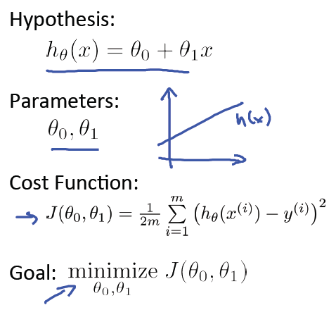
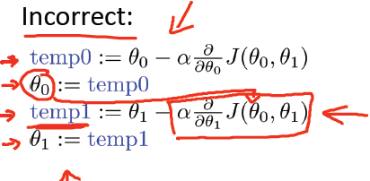

===================
单变量线性回归
===================

斯坦福大学机器学习第二课"单变量线性回归(Linear regression with one variable)“
学习笔记，本次课程主要包括7部分：

1) Model representation(模型表示
2) Cost function(代价函数，成本函数)
3) Cost function intuition I(直观解释1)
4) Cost function intuition II(直观解释2)
5) Gradient descent(梯度下降)
6) Gradient descent intuition(梯度下降直观解释)
7) Gradient descent for linear regression(应用于线性回归的的梯度下降算法)

以下是第二课“单变量线性回归”的课件资料下载链接，视频可以在Coursera机器学习课程上观看或下载：
`PPT <https://d19vezwu8eufl6.cloudfront.net/ml/docs%2Fslides%2FLecture2.pptx>`_
`PDF <https://d19vezwu8eufl6.cloudfront.net/ml/docs%2Fslides%2FLecture2.pdf>`_

Model representation(模型表示)
-------------------------------

回到 :doc:`introduction` 中的房屋价格预测问题，首先它是一个有监督学习的问题
（对于每个样本的输入，都有正确的输出或者答案），同时它也是一个回归问题
（预测一个实值输出）。训练集表示如下：

其中：

m = 训练样本的数目

x's = “输入”变量，也称之为特征

y's = “输出”变量，也称之为“目标”变量

对于房价预测问题，学习过程可用下图表示：

其中x代表房屋的大小，y代表预测的价格，h(hypothesis)将输入变量 x 映射到输出变量 y，如何表示h?

事实上Hypothesis可以表示成如下形式：

.. math::

   h_\theta(x) = \theta_0 + \theta_1 x

简写为 h(x)，也就是带一个变量的线性回归或者单变量线性回归问题。

Cost function(代价函数，成本函数)
------------------------------------

对于Hypothesis: :math:`h_\theta(x) = \theta_0 + \theta_1 x`,
:math:`\theta_i` 为参数, 如何求 :math:`\theta_i` ?

.. image:: images/2-3.png
   :scale: 70 %

构想： 对于训练集(x, y)，选取参数 :math:`\theta_0, \theta_1` 使得 :math:`h_\theta(x)` 尽可能的接近y。

如何做呢？一种做法就是求训练集的平方误差函数（squared error function），Cost Function可表示为:

.. math::

   J(\theta_0, \theta_1) = \frac{1}{2m}\sum_{i=1}^m{(h_\theta(x^{(i)}) - y^{(i)})^2}

并且选取合适的参数使其最小化，数学表示如下：

.. math::

   \displaystyle\mathop{\mathrm{minimize}}\limits_{\theta_0, \theta_1} J(\theta_0, \theta_1)

Cost function intuition I(直观解释1)
-------------------------------------

直观来看，线性回归主要包括如下四大部分，分别是Hypothesis, Parameters, Cost Function, Goal:

这里作者给出了一个简化版的Cost function解释，也就是令 :math:`\theta_0` 为0：

.. image:: images/2-5.png
   :scale: 70 %

然后令 :math:`\theta_1` 分别取1、0.5、-0.5等值，同步对比 :math:`h_\theta(x)`
和 :math:`J(\theta_0, \theta_1)` 在二维坐标系中的变化情况，具体可参考原PPT中的对比图，很直观。

Cost function intuition II(直观解释2)
--------------------------------------

回顾线性回归的四个部分，这一次不再对Cost Function做简化处理，这个时候
:math:`J(\theta_0, \theta_1)` 的图形是一个三维图或者一个等高线图，具体可参考原课件。

可以发现，当 :math:`h_\theta(x)` 的直线越来越接近样本点时，
:math:`J(\theta_0, \theta_1)` 在等高线的图中的点越来越接近最小值的位置。

Gradient descent(梯度下降)
----------------------------

应用的场景之一——最小值问题：

对于一些函数，例如 :math:`J(\theta_0, \theta_1)`,
目标: :math:`\displaystyle\mathop{\mathrm{minimize}}\limits_{\theta_0, \theta_1} J(\theta_0, \theta_1)`

**方法的框架:**

#. 给 :math:`\theta_0, \theta_1` 一个初始值，例如都等于0

#. 每次改变 :math:`\theta_0, \theta_1` 的时候都保持 :math:`J(\theta_0, \theta_1)` 递减，
   直到达到一个我们满意的最小值；

对于任一 :math:`J(\theta_0, \theta_1)`, 初始位置不同，最终达到的极小值点也不同，例如以下两个例子：

.. image:: images/2-6.png
   :scale: 70 %

.. image:: images/2-7.png
   :scale: 70 %

**梯度下降算法：**

重复下面的公式直到收敛：

.. image:: images/2-8.png
   :scale: 70 %

**举例：**

参数正确的更新过程如下（同步更新）：

错误的更新过程如下：

Gradient descent intuition(梯度下降直观解释)
-----------------------------------------------

举例，对于一个简化的 :math:`J(\theta_1)` 来说，无论抛物线的左边还是右边，
在梯度下降算法下， :math:`\theta_1` 都是保持正确的方向（递增或递减）

对于learning rate(又称为步长)来说:

如果 :math:`\alpha` 过小，梯度下降可能很慢；如果过大，梯度下降有可能“迈过”（overshoot）最小点，
并且有可能收敛失败，并且产生“分歧”(diverge)

梯度下降可以使函数收敛到一个局部最小值，特别对于learning rate :math:`\alpha` 是固定值的时候：

.. image:: images/2-12.png
   :scale: 70 %

当函数接近局部最小值的时候，梯度下降法将自动的采取“小步子”， 所以没有必要随着时间的推移减小learning rate.

关于梯度下降算法，可以参考 `维基百科 <http://zh.wikipedia.org/wiki/%E6%A2%AF%E5%BA%A6%E4%B8%8B%E9%99%8D%E6%B3%95>`_ 的介绍

Gradient descent for linear regression(应用于线性回归的的梯度下降算法)
--------------------------------------------------------------------------

梯度下降算法：

.. image:: images/2-13.png
   :scale: 70 %

线性回归模型：

.. image:: images/2-14.png
   :scale: 70 %

:math:`J(\theta_0, \theta_1)` 对 :math:`\theta_0, \theta_1` 求导得：

在梯度下降算法中进行替换，就得到单变量线性回归梯度下降算法：

.. image:: images/2-16.png
   :scale: 70 %

详细的图形举例请参考官方PPT，主要是在等高线图举例梯度下降的收敛过程，
逐步逼近最小值点，其中一幅图说明：线性回归函数是凸函数(convex function)，具有碗状（bowl shape)。

**总结**： 这里的梯度下降算法也称为"Batch" 梯度下降: 梯度下降的每一步都使用了所有的训练样本。

